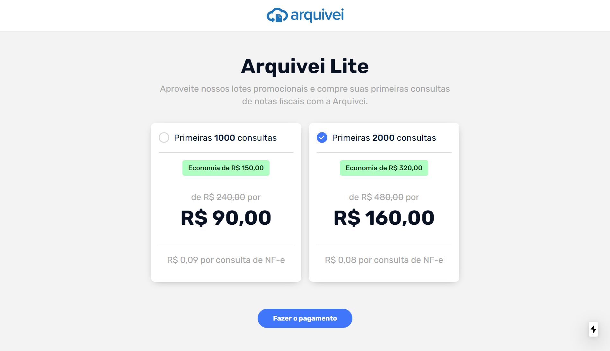
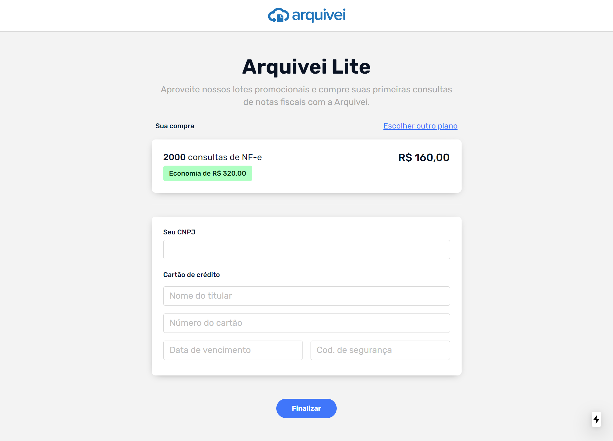

# Arquivei Lite

Check the result of the challenge proposed by Arquivei.  
This is my first project using NextJs.  
* Development time: 10h
* All fields have validation and mask.
* Don't have form and validation library.
* All screens are responsive






## Getting Started

Install the dependencies:
```bash
npm install
```

Run the development server:
```bash
npm run dev
```

Open [http://localhost:3000](http://localhost:3000) with your browser to see the result.